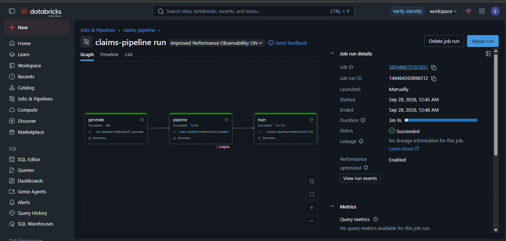
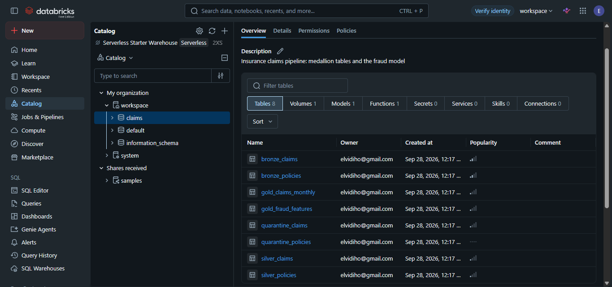
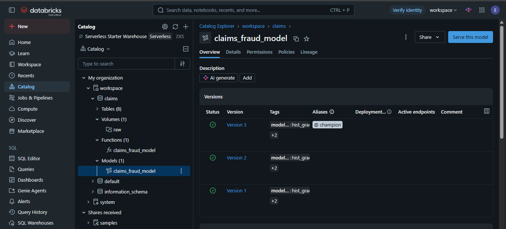

# Insurance Claims Data Pipeline

[](https://github.com/elviDev/claims-pipeline/actions/workflows/ci.yml)

An end-to-end data and ML pipeline for insurance claims: raw data in, validated
tables, a fraud-risk model, an LLM that reads claim descriptions, and an API
that serves it all. Built to practise the stack used by data engineering teams
in insurance (Spark / Databricks, MLflow, Docker, CI/CD, LLMs).

> Built step by step, one working piece at a time. Runs locally in Docker and on Databricks.

## Roadmap

| Step | What | Status |
|------|------|--------|
| 1 | Synthetic claims and policies data, with realistic data quality problems | ✅ |
| 2 | Bronze / silver / gold layers in PySpark, with data quality checks | ✅ |
| 3 | Fraud-risk model, tracked with MLflow | ✅ |
| 4 | FastAPI service that scores a claim, running in Docker | ✅ |
| 5 | LLM step: extract damage type and urgency from the claim description | ✅ |
| 6 | GitHub Actions: tests and Docker build on every push | ✅ |
| 7 | Run the pipeline on Databricks | ✅ |

## How the pipeline works

```
 raw CSV ──► BRONZE ──► SILVER ──────────► GOLD
             as-is,     typed, deduped,    claims_monthly  (reporting)
             all text   rules checked      fraud_features  (ML model)
                           │
                           └──► QUARANTINE  (bad rows + the rules they broke)
```

**Bronze** stores the raw data exactly as received, plus load time and source
file. Nothing is fixed here, so silver can always be rebuilt if a bug is found.

**Silver** converts types, removes duplicates and checks every row against data
quality rules. Problems with a safe fix are fixed (a missing channel becomes
`unknown`). Problems that would mean guessing, like a missing claim amount, go
to **quarantine** with the reason attached. Nothing is silently dropped.

**Quality gate**: if more than 5% of claims fail the rules, the run stops
before writing gold. A broken source file should never reach reports or models.

**Gold** builds tables for a specific use: a monthly summary for reporting, and
one row per claim with fraud signals for the model.

### Data quality rules

| Rule | Check | Action |
|------|-------|--------|
| `claim_amount_present` | amount is not missing | quarantine |
| `claim_amount_positive` | amount > 0 | quarantine |
| `incident_date_valid` | incident date is a real date | quarantine |
| `reported_after_incident` | report date ≥ incident date | quarantine |
| `policy_exists` | claim belongs to a known policy | quarantine |
| duplicate `claim_id` | same claim loaded twice | keep one |
| missing `channel` | not critical to the claim | fill with `unknown` |

Each run writes `data/quality_report.json`. On the default generated data, the
pipeline catches exactly the problems step 1 injected:

```
claims loaded:        20,200
duplicates removed:      200
quarantined:             498  (2.5%)
  missing amount         200
  negative amount        100
  reported too early     100
  unknown policy         100
clean claims in silver: 19,502
```

## Fraud model

`src/model/train.py` trains on `gold/fraud_features` (one row per claim) and
records everything in MLflow.

**Two models.** A logistic regression baseline, and a gradient-boosted tree
model. The baseline is there to answer "is the fancier model actually better?"
Both are scikit-learn Pipelines that include the data prep (one-hot encoding of
product, region and channel), so the saved model takes a raw claim and does its
own encoding. Class imbalance is handled with `class_weight="balanced"`.

**Choosing which claims to flag.** Investigators can only review so many
claims. The threshold is set so the model flags the riskiest 5% of claims
(`--review-rate`), measured on the training data, never the test data.

**Metrics.** About 3% of claims are fraud, so a "model" that never flags
anything is 97% accurate and useless. The main metric is PR AUC (average
precision), which measures how well fraud rises to the top of the list. A random
ranking scores about 0.03.

Results on the held-out test set (3,901 claims, 127 of them fraud):

| Model | ROC AUC | PR AUC | Precision | Recall | Accuracy |
|-------|---------|--------|-----------|--------|----------|
| Logistic regression (baseline) | 0.659 | 0.081 | 11.9% | 21.3% | 92.3% |
| **Gradient boosting** (registered) | **0.681** | **0.119** | **14.3%** | 21.3% | 93.3% |
| Never flag anything | | 0.033 | | 0% | 96.7% |

Reviewing about 5% of claims, the tree model catches 21% of fraud, roughly 4x
better than picking claims at random. When it flags a claim, it's right 14% of
the time, against a 3.3% base rate. Both models catch the same number of fraud
cases, but the tree model gets there flagging fewer honest customers, and it
ranks fraud higher overall (PR AUC 0.119 vs 0.081).

**Why the scores aren't higher.** The generator labels a claim as fraud from
three red flags plus random chance, and 49% of the test set's fraud cases have
no red flag at all. Scoring the test set with the exact formula that created
the labels gives ROC AUC 0.697 and PR AUC 0.121, so the tree model is already
at the ceiling this data allows.

**Reproducible across environments.** Spark doesn't return rows in a fixed
order, and the same table came back in a different order on Databricks than
locally. Since the train/test split picks rows by position, the same data and
seed gave different scores. The features are now sorted by `claim_id` before
the split, and a test checks that shuffled input gives the same split.

**How much to trust one split.** Shuffling the rows before that fix moved the
tree model's PR AUC between 0.093 and 0.118, just from which 127 fraud cases
landed in the test set. That's as big as the gap between the two models. With
fraud this rare, the next improvement would be cross-validation: score on
several splits and report the average and the spread.

**Known shortcut.** `amount_vs_product_median` is computed over all claims
before the train/test split, so the test set has a small influence on a
training feature. Fine for a demo; in production it would be computed from
training data only.

**What MLflow records per run:** model settings, the review rate, the dataset
(with a fingerprint), the git commit, all metrics, the confusion matrix as an
image, and the model with its input signature and an example. The best model by
PR AUC is registered as `claims-fraud-model` with the alias `champion`, tagged
with its threshold. The API in step 4 loads `models:/claims-fraud-model@champion`,
so deploying a new model means moving the alias, not changing code.

Run records and the registry are stored in `mlflow.db` (SQLite), model files in
`mlruns/`. Both are git-ignored and rebuilt by running the training script.

## Scoring API

`src/api/` is a FastAPI service. A claims system sends a new claim and gets
back a fraud score and whether a human should review it.

```bash
docker compose up api          # interactive docs on http://localhost:8000/docs
```

```bash
curl -X POST localhost:8000/score -H "Content-Type: application/json" -d '{
  "claim_id": "CLM-DEMO-1", "product": "auto", "region": "Madrid", "channel": "web",
  "customer_age": 42, "claim_amount": 6000, "annual_premium": 600,
  "policy_start_date": "2024-01-01", "incident_date": "2024-01-08", "report_date": "2024-02-10"
}'
```

```json
{"claim_id": "CLM-DEMO-1", "fraud_score": 0.8309, "flag_for_review": true, "threshold": 0.7487, "model_version": "4"}
```

| Endpoint | What it does |
|----------|--------------|
| `GET /health` | Status and which model version is loaded. Also used by the Docker healthcheck. |
| `POST /score` | One claim in, score and review flag out |
| `POST /score/batch` | A list of claims, e.g. for a nightly job |

**Loaded once, at startup.** The API asks the registry which version is
`@champion`, then loads that version's model, threshold and product medians
together, so they always match. If the model can't be loaded, the server
doesn't start. To deploy or roll back a model, move the alias in MLflow and
restart the API. No code change.

**Raw claims in, features computed by the API.** The claims system knows dates
and amounts, not `days_since_policy_start`. So `src/api/features.py` computes
the features the same way the Spark gold layer does. If the two ever differed,
the model would get inputs it never saw in training and return quietly wrong
scores (training/serving skew). Two things prevent that:
- the product medians come from the model's own MLflow run, not recomputed
- `tests/test_features.py` runs the same claims through Spark and through the
  API code, and fails if any feature differs. Changing one rounding from 3 to 2
  decimals makes it fail on 1,331 claims.

**Bad input gets a 422, not a score.** The request rules match the silver
quality rules: amounts above zero, report date not before incident date, and
only products, regions and channels the model was trained on.

**One JSON log line per prediction** (claim id, score, flag, model version,
latency). Raw material for monitoring: is the flag rate still about 5%, are
scores drifting, is it getting slower?

**What would change in production:** a shared MLflow server (or Databricks
Model Serving) instead of a local SQLite file; the model pulled at deploy time
or baked into the image; several copies of the API behind a load balancer on
Kubernetes, using `/health` as the readiness probe; and the prediction logs
shipped to a monitoring tool.

## LLM extraction

Each claim has a free-text description. `src/llm/` turns it into fields a
claims handler can route on:

```
"Burst pipe in the bathroom flooded the hallway."
  -> damage_type=water, urgency=high, injury_mentioned=false,
     third_party_involved=false, summary="Bathroom burst pipe caused flooding in hallway."
```

`POST /claims/triage` takes a claim plus its description and returns the fraud
score and these fields in one answer.

**How it works.** The LLM is called through the `openai` package with a
configurable `base_url`, so the same code talks to Ollama on a laptop or to
OpenAI by changing `.env` (see `.env.example`). Temperature 0, and the JSON
schema is sent with the request so the model is constrained to the right
shape. The answer is then **validated with pydantic anyway**: allowed values
only, summary under 200 characters. If it's invalid, the retry shows the model
its answer and the error. After two failures the claim gets
`damage_type=other, needs_manual_review=true` for a person to read. Results are
cached by a hash of the description. If the LLM is down, `/claims/triage` still
returns the fraud score.

**A fake extractor** (keyword rules) has the same interface. Tests and CI use
it, so they never call a real model, and so does the API when no LLM is
configured (the response says so). It's also the baseline the LLM has to beat.

**Evaluation.** `src/llm/evaluate.py` runs an extractor over 29 labelled
descriptions: the generator's 18 templates, plus 11 harder texts it never
produces (a tree falling on a car, a late suitcase, one in Spanish). Each run
is logged to MLflow (experiment `claims-llm-extraction`) with the model name,
prompt version, accuracy per field, and every case with expected vs actual.
Run on a laptop CPU with Ollama:

| Extractor | Damage type | Urgency | Injury | Third party | All 4 right | Templates | New text | Sec / claim |
|-----------|-------------|---------|--------|-------------|-------------|-----------|----------|-------------|
| Keyword rules | 83% | **76%** | 97% | 93% | **66%** | **94%** | 18% | 0.0 |
| qwen2.5:0.5b | 59% | 28% | 83% | 66% | 17% | 11% | 27% | 1.2 |
| gemma3:1b | 76% | 41% | 90% | 38% | 10% | 17% | 0% | 3.3 |
| **qwen2.5:3b** | **86%** | 45% | **100%** | 93% | 38% | 28% | **55%** | 6.5 |

What it shows:
- The keyword rules win on the templates they were written from (94%) and
  collapse on new wording (18%). "Train was 3 hours late" comes out as weather,
  because "train" contains "rain".
- qwen2.5:3b copes much better with new text (55%), including Spanish, and is
  the best at damage type and injury. The smaller models are worse than the
  rules, each in its own way: the 0.5B model calls nearly everything urgent,
  gemma3:1b says a third party was involved in almost every claim.
- Urgency is the weak field for every LLM. Its rules are the fuzziest.

The fake extractor's keywords come only from the generator templates. My first
version also used words from the evaluation cases, which scored 86% and was
tuning on the test set. Improving the prompt against these same 29 cases would
be the same mistake: a v2 prompt needs a separate held-out set to be measured on.

**Privacy.** Claim descriptions contain personal data. Here the model runs
locally, so nothing leaves the machine. In a real deployment at an insurer you'd
mask names and addresses before sending text anywhere, or use a model hosted in
the company's own cloud in the EU (for example Azure OpenAI or AWS Bedrock in an
EU region), because GDPR applies.

```bash
docker compose run --rm pipeline python -m llm.evaluate --fake            # baseline
docker compose run --rm pipeline python -m llm.evaluate                   # model from .env
docker compose run --rm -e LLM_MODEL=gemma3:1b pipeline python -m llm.evaluate
```

## CI

Every push and pull request runs `.github/workflows/ci.yml` on GitHub Actions:

1. **Tests.** Builds the Docker image and runs all 86 tests inside it. The
   tests use the same image as local development, so CI checks the real
   environment (Python, Java, package versions) and not a copy of it. The
   container runs with **no network**, so no test can call Ollama, OpenAI or
   anything else outside it; the LLM tests use the fake extractor or a stand-in
   client. There is no `.env` in CI.
2. **Docker image.** Only if every test passed, builds the image tagged with
   the commit. Build only for now; in a real setup this is the step that pushes
   the image to a registry, so only tested code ever gets released.

Docker layers are cached between runs, so the slow `pip install` layer is only
rebuilt when `requirements.txt` changes.

Why it matters: a change that breaks the quality rules, the model, the
Spark-vs-API feature match (the skew test) or the API shows up as a red cross
on the commit, before anyone deploys it. The badge at the top shows the result
for the latest commit on `main`.

## Running on Databricks

The same code runs on Databricks Free Edition (serverless compute, Unity
Catalog). Only the storage changes: each medallion layer becomes a managed
**Delta table** in Unity Catalog instead of a parquet folder.

| | Local | Databricks |
|---|---|---|
| Raw CSVs | `data/raw/` | volume `/Volumes/workspace/claims/raw/` |
| Bronze / silver / quarantine / gold | parquet folders under `data/` | tables `workspace.claims.bronze_claims`, `silver_claims`, `quarantine_claims`, `gold_claims_monthly`, `gold_fraud_features` (+ policies) |
| Table format | parquet | Delta (all-or-nothing writes, version history) |
| MLflow runs | `mlflow.db` | the workspace, experiment `/Users/<you>/claims-fraud` |
| Model registry | local SQLite | Unity Catalog: `workspace.claims.claims_fraud_model@champion` |

`src/pipeline/storage.py` is the only place that knows the difference: the
pipeline says "write this as silver / claims", and `Storage` turns that into a
folder or a table name. `get_spark()` returns the existing session on
Databricks, and nothing uses `.cache()` (serverless doesn't support it): each
layer is read back from the stored layer before it. Table mode is tested
locally against Spark's own catalog, so CI covers it too.

**Notebooks** (`notebooks/`, Databricks source format, all logic stays in `src/`):

| Notebook | What it does |
|---|---|
| `00_setup` | creates schema `workspace.claims` and volume `raw` (run once) |
| `01_generate` | generates the synthetic CSVs into the volume |
| `02_pipeline` | runs bronze → silver → gold as tables, shows the quality report |
| `03_train` | trains the model, logs to MLflow, registers it in Unity Catalog |
| `04_explore` | SQL on the gold tables: fraud rate by product, monthly cost, quarantine reasons, Delta history |

**The Job** runs `01_generate → 02_pipeline → 03_train` as dependent tasks on
serverless compute. If the quality gate fails, `02_pipeline` fails and training
is skipped, so a model never trains on a broken load. The job is also defined
as code in `databricks.yml` (a Databricks Asset Bundle):

```bash
databricks auth login --host https://<your-workspace-url>
databricks bundle validate
databricks bundle deploy            # uploads the code, creates "[dev <you>] claims-pipeline"
databricks bundle run claims_job    # runs it and follows progress
```

<!-- Screenshot: the job run graph (generate -> pipeline -> train, all green)

-->

<!-- Screenshot: the tables in Catalog Explorer (workspace > claims)

-->

<!-- Screenshot: the registered model with its champion alias

-->

## Running it

### With Docker (recommended, works the same on Windows, Mac and Linux)

Spark needs Java, and on Windows it also needs extra Hadoop tools to write
files. Docker avoids all of that.

```bash
docker compose build
docker compose run --rm pipeline python src/generate_claims.py
docker compose run --rm pipeline                     # runs the pipeline
docker compose run --rm pipeline python -m model.train   # trains and registers the model
docker compose run --rm pipeline pytest              # runs the tests
docker compose up mlflow                             # MLflow UI on http://localhost:5000
docker compose up api                                # scoring API on http://localhost:8000/docs
docker compose run --rm pipeline python -m llm.evaluate  # evaluate the LLM extraction
```

For the LLM, copy `.env.example` to `.env` and fill it in. Without it,
everything still runs with the keyword-rules extractor.

Output lands in `data/`, `mlflow.db` and `mlruns/` on your machine.

### Without Docker

Needs Python 3.10+ and Java 17 or 21.

```bash
python -m venv .venv
source .venv/bin/activate          # Windows Git Bash: source .venv/Scripts/activate
pip install -r requirements.txt

python src/generate_claims.py
PYTHONPATH=src python -m pipeline.run_pipeline
PYTHONPATH=src python -m model.train
pytest
mlflow ui --backend-store-uri sqlite:///mlflow.db
PYTHONPATH=src uvicorn api.main:app --port 8000
```

## Project structure

```
src/
  generate_claims.py     step 1: synthetic data
  pipeline/
    spark.py             Spark session settings (local, or the Databricks session)
    storage.py           step 7: parquet folders locally, Unity Catalog tables on Databricks
    bronze.py            raw ingestion
    quality.py           rule engine: apply rules, split valid/quarantine, report
    silver.py            cleaning + the rules for policies and claims
    gold.py              reporting and feature tables
    run_pipeline.py      runs everything, applies the quality gate
  model/
    train.py             step 3: train, evaluate, log to MLflow, register
  api/
    features.py          step 4: raw claim -> model features (mirrors gold.py)
    main.py              step 4/5: FastAPI app, loads @champion at startup, /claims/triage
  llm/
    schema.py            step 5: the fields to extract, with their rules
    extract.py           step 5: fake (keyword) and LLM extractors
    evaluate.py          step 5: 29 labelled cases, results to MLflow
notebooks/               step 7: Databricks notebooks (setup, generate, pipeline, train, explore)
databricks.yml           step 7: the Databricks job as code (Asset Bundle)
tests/                   86 tests: pipeline rules, storage, model, skew test, API, LLM
.github/workflows/ci.yml step 6: tests + Docker build on every push
```

## The data

**policies.csv**: one row per policy (product, region, customer age, start and end date, premium).

**claims.csv**: one row per claim (policy, incident and report dates, amount,
channel, free-text description, fraud label).

The fraud label follows real red flags: claims filed in the first month of a
policy, amounts far above normal for the product, and incidents reported late.
The raw data is intentionally dirty (missing values, negative amounts,
impossible dates, unknown policies, duplicates) so the pipeline has real
problems to catch.
